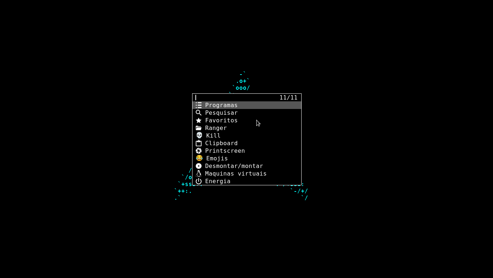

# Minha build do dmenu

## Patches

- Suporte a fontes coloridas ([allow color font](https://tools.suckless.org/dmenu/patches/allow-color-font/))

- Procura por partes de palavras ([fuzzymatch](https://tools.suckless.org/dmenu/patches/fuzzymatch/))

- Partes sendo procuradas ficam em amarelo ([fuzzyhighlight](https://tools.suckless.org/dmenu/patches/fuzzyhighlight/))

- colunas ([grid](https://tools.suckless.org/dmenu/patches/grid/))

- navegação pelas colunas ([gridnav](https://tools.suckless.org/dmenu/patches/gridnav/))

- Borda ([border](https://tools.suckless.org/dmenu/patches/border/))

- numeração da quantidade achada/total de itens ([numbers](https://tools.suckless.org/dmenu/patches/numbers/))

- Procura ignora letra maiúsculas se não especificado ([case insensitive](https://tools.suckless.org/dmenu/patches/case-insensitive/))

- Centraliza janelas quando especificado ([center](https://tools.suckless.org/dmenu/patches/center/))

- Transparência ([alpha](https://tools.suckless.org/dmenu/patches/alpha/))

- Altura das linhas controlável ([line height](https://tools.suckless.org/dmenu/patches/line-height/))

- Posição controlável ([xyw](https://tools.suckless.org/dmenu/patches/xyw/))

- Linhas aparecem abaixo do prompt ([lines below prompt](https://tools.suckless.org/dmenu/patches/lines-below-prompt/))

- Presseleção de itens ([preselect](https://tools.suckless.org/dmenu/patches/preselect/))
