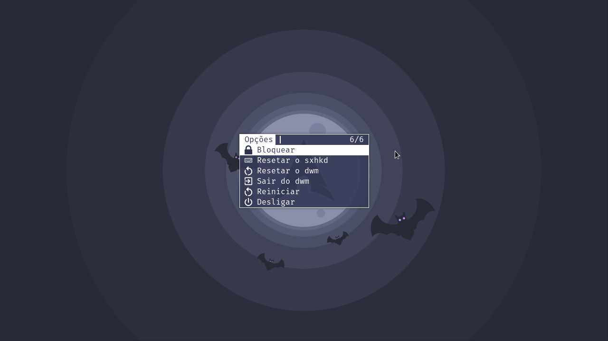

# Minha build do dmenu

[Scripts do dmenu](https://github.com/LucasTavaresA/dmenuscripts)

## Patches

-   Suporte a fontes coloridas ([allow color font](https://tools.suckless.org/dmenu/patches/allow-color-font/))

-   Procura por partes de palavras ([fuzzymatch](https://tools.suckless.org/dmenu/patches/fuzzymatch/))

-   Partes sendo procuradas ficam em amarelo ([fuzzyhighlight](https://tools.suckless.org/dmenu/patches/fuzzyhighlight/))

-   colunas ([grid](https://tools.suckless.org/dmenu/patches/grid/))

-   navegação pelas colunas ([gridnav](https://tools.suckless.org/dmenu/patches/gridnav/))

-   Borda ([border](https://tools.suckless.org/dmenu/patches/border/))

-   numeração da quantidade achada/total de itens ([numbers](https://tools.suckless.org/dmenu/patches/numbers/))

-   Procura ignora letra maiúsculas ([case insensitive](https://tools.suckless.org/dmenu/patches/case-insensitive/)), Ativado por padrão **pode ser desativado pela flag** `-s`

-   Centraliza janelas quando especificado ([center](https://tools.suckless.org/dmenu/patches/center/)), **Largura definida pela flag** `-cw` que deve ser usada em conjunto com a flag `-c`

-   Transparência ([alpha](https://tools.suckless.org/dmenu/patches/alpha/))

-   Altura das linhas controlável ([line height](https://tools.suckless.org/dmenu/patches/line-height/))

-   Posição controlável ([xyz](https://tools.suckless.org/dmenu/patches/xyw/))

-   Linhas aparecem abaixo do prompt ([lines below prompt](https://tools.suckless.org/dmenu/patches/lines-below-prompt/))

-   Presseleção de itens ([preselect](https://tools.suckless.org/dmenu/patches/preselect/))

-   Seleciona caso exista apenas um item ([instant](https://tools.suckless.org/dmenu/patches/instant/)), Ativado por padrão **pode ser desativado pela flag** `-a`
